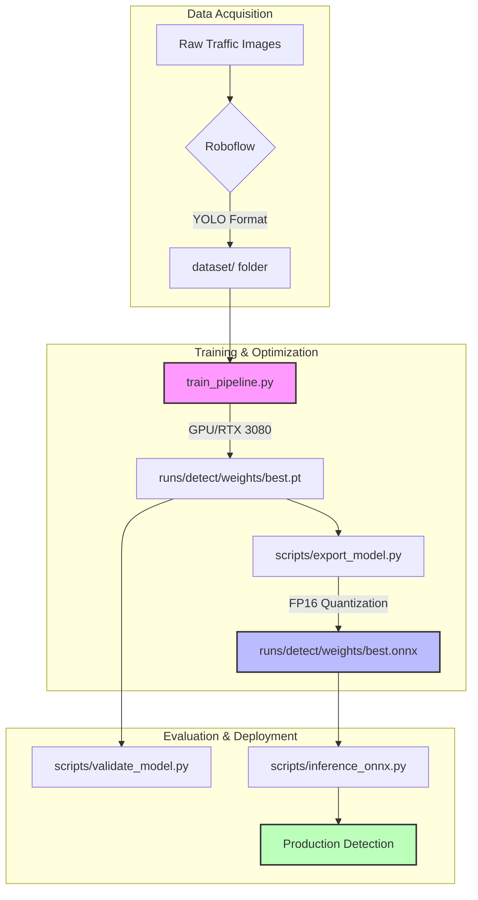
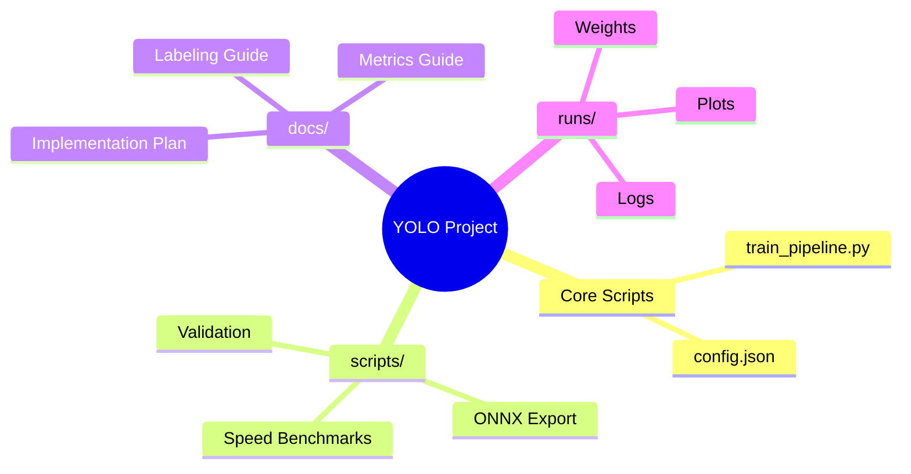

<div align="center">

# YOLO11 Traffic Sign Detection Pipeline

[](https://www.python.org/downloads/)
[](https://github.com/ultralytics/ultralytics)
[](https://www.nvidia.com/en-us/geforce/graphics-cards/30-series/rtx-3080/)
[](https://www.gnu.org/licenses/agpl-3.0.en.html)

A production-grade computer vision pipeline designed for high-accuracy traffic sign recognition.

Leveraging <strong>YOLO11</strong> (Ultralytics) and optimized for <strong>NVIDIA GPU</strong> acceleration with native <strong>ONNX</strong> support.

</div>


---

## System Architecture

### 1. High-Level Data Flow


---

## Tech Stack
*   **Engine**: YOLO11 (Ultralytics v8.x implementation)
*   **Hardware**: Optimized for NVIDIA RTX 3080 (Ampere Architecture)
*   **Runtime**: [ONNX Runtime](https://onnxruntime.ai/) with CUDA Execution Provider
*   **Configuration**: Clean JSON-based hyperparameter management

---

## Quick Start Guide

### 1. Installation
Deploy the environment in seconds:
```powershell
python -m venv venv
.\run_activate.bat  # Custom script to activate and check venv
pip install -r requirements.txt
```

### 2. The Power of Automation (.bat shortcuts)
No terminal complexity required. Use these one-click shortcuts:

| Shortcut | Description |
| :--- | :--- |
| **`run_menu.bat`** | **NEW!** A master menu to access all tools from one place. |
| **`run_label_check.bat`** | Visualizes random dataset samples to verify boxes and normalization. |
| **`run_live_inference.bat`** | Launches real-time detection using your webcam. |
| **`run_train.bat`** | Launches the master training pipeline using `config.json`. |
| **`run_validate.bat`** | Generates accuracy reports (P, R, mAP) on the validation set. |
| **`run_export.bat`** | Converts your PyTorch model to an optimized FP16 ONNX format. |
| **`run_benchmark.bat`** | Compares native vs. optimized inference speeds. |
| **`run_tensorboard.bat`** | Visualizes loss and mAP curves at `http://localhost:6006`. |

---

## Model Performance

### Benchmark Results (RTX 3080 @ 640px)

```mermaid
gantt
    title Inference Latency Comparison
    dateFormat  X
    axisFormat %s ms
    section Standard
    PyTorch (.pt)  :0, 13
    section Optimized
    ONNX (FP16)    :0, 10
```


*   **Precision (P)**: 0.941
*   **Recall (R)**: 0.922
*   **mAP@50**: 0.950
*   **mAP@50-95**: 0.832

---

## Project



---

## Configuration
Hyperparameters are decoupled from code in `config.json`.
```json
{
  "training": {
    "epochs": 100,
    "patience": 15,
    "batch": 16,
    "optimizer": "auto"
  }
}
```

## Troubleshooting
### Distant/Small Objects Not Detected?
Distant traffic signs can be challenging for "Nano" models. To improve detection:
1.  **Lower Confidence Threshold**: The default is `0.25`. You can try `0.15` by running:
    ```powershell
    $env:MIN_CONFIDENCE = "0.15"; .\run_live_inference.bat
    ```
2.  **Increase Resolution**: If your webcam supports it, try increasing the inference size to `1280` (this will lower FPS):
    ```powershell
    $env:IMG_SIZE = "1280"; .\run_live_inference.bat
    ```
3.  **Model Scale**: If accuracy is still low, consider changing the `model_variant` in `config.json` to `yolo11s.pt` (Small) or `yolo11m.pt` (Medium) and retraining.

## Extended Documentation
*   **[Metrics Guide](docs/metrics_guide.md)**: Deep dive into mAP, Precision, and Recall.
*   **[Implementation Plan](docs/implementation_plan.md)**: The roadmap for this project.
*   **[Labeling Guideline](docs/labeling_guideline.md)**: How to prepare new data using CVAT.

