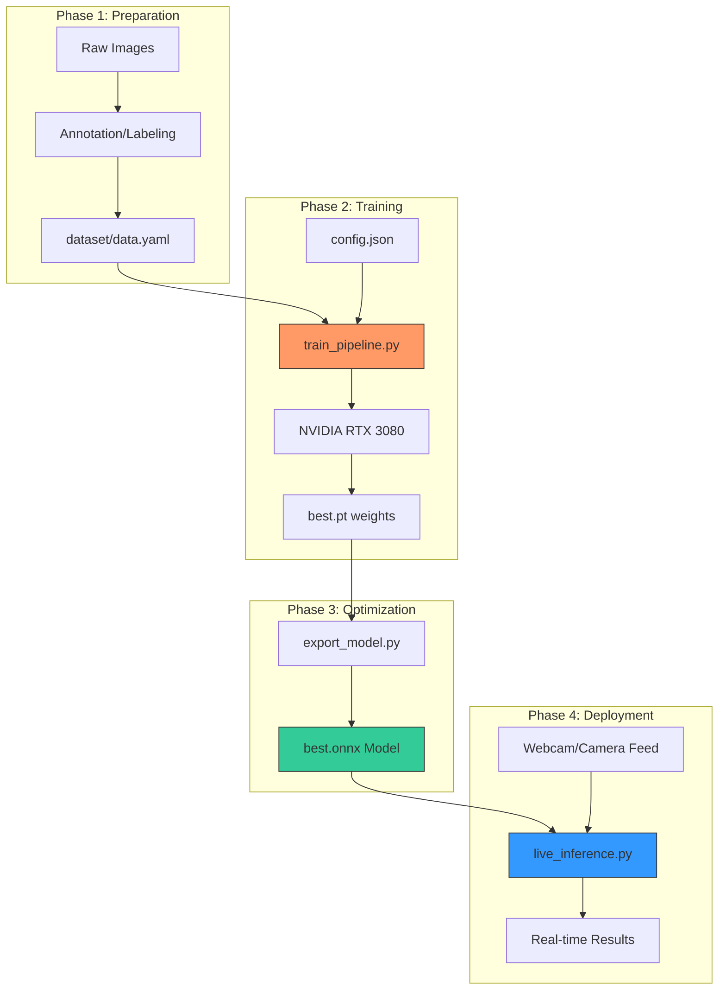
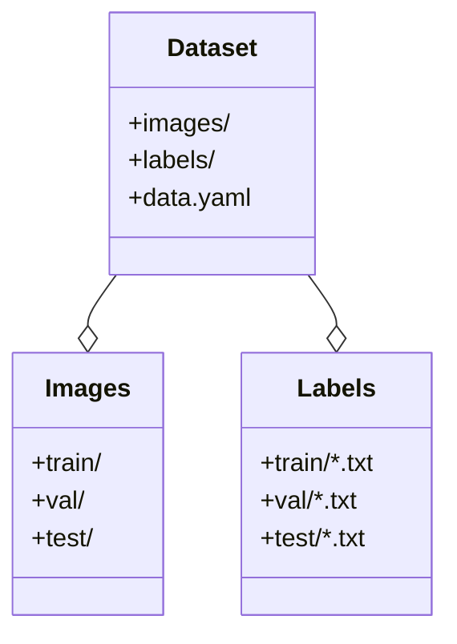
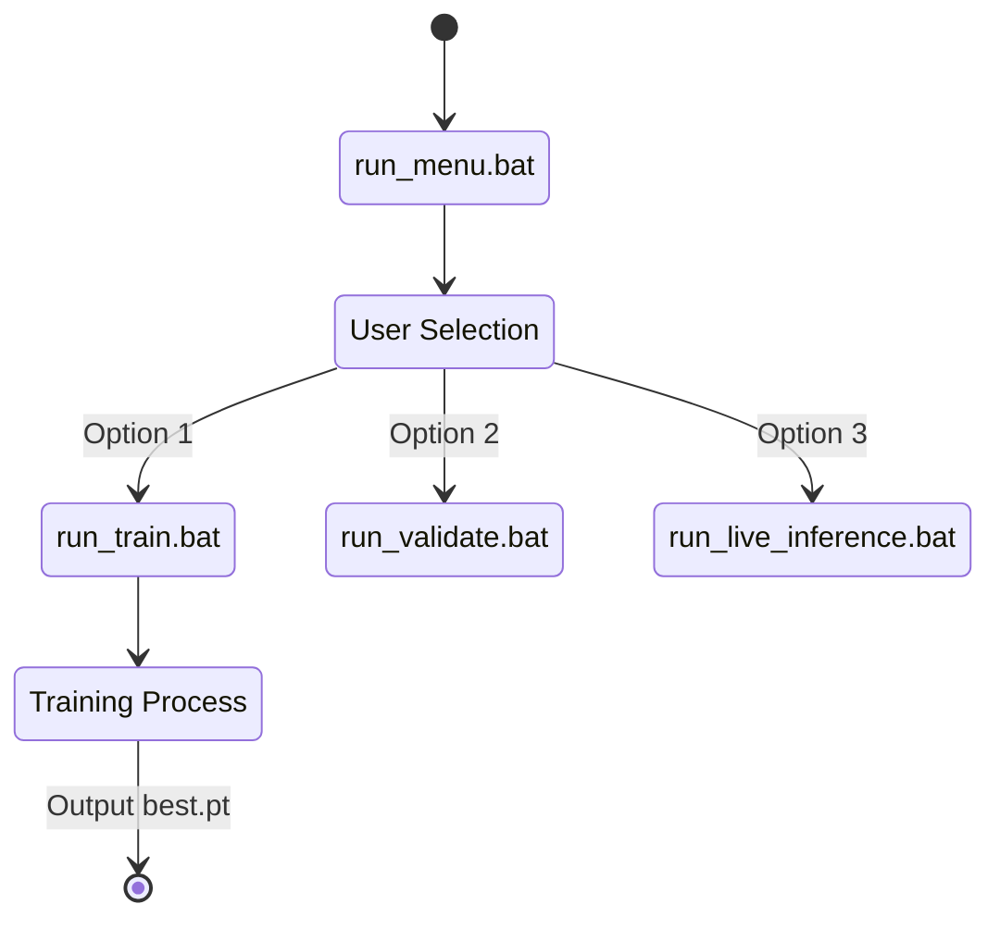

# Project Overview & Architecture Documentation

This document provides a technical deep-dive into the YOLOv11 Traffic Sign Detection project, covering the architecture, data flow, and functional components.

---

## 1. System Architecture

The project is designed as a modular, industrial-grade pipeline. It separates configuration, logging, core logic, and utility scripts to ensure scalability and ease of deployment.

### 2. High-Level Logic Flow

The following diagram illustrates the life cycle of the model, from raw data to real-time inference.

---

## 2. Directory Structure & Component Roles

### Core Project Root
- **`train_pipeline.py`**: The master entry point for training. It loads configurations from `config.json` and manages the GPU training lifecycle.
- **`config.json`**: Centralized configuration file for hyperparameters like `epochs`, `batch size`, and `optimizer`.
- **`yolo26n.pt`**: Base pre-trained weights used for transfer learning.

### `scripts/` (The Utility Engine)
The `scripts/` folder contains specific logic for different stages of the pipeline:

| Script | Responsibility |
| :--- | :--- |
| **`logger_utils.py`** | **Production Logging**: Implements a dual logger (Console + JSON) and handles automatic `sys.path` injection. |
| **`live_inference.py`** | **Real-time Engine**: Captures webcam frames, runs inference (ONNX or PT), and calculates FPS. |
| **`export_model.py`** | **Optimizer**: Converts `.pt` weights to `.onnx` for faster deployment. |
| **`visualize_labels.py`** | **QA Tool**: Displays random images from the dataset with their bounding boxes to verify label correctness. |
| **`validate_model.py`** | **Evaluation**: Runs a full validation suite to calculate mAP50 and Precision/Recall metrics. |
| **`check_gpu.py`** | **Diagnostics**: Verifies if PyTorch can see the RTX 3080/CUDA. |

---

## 3. Data Architecture

The project follows the standard YOLOv8/v11 directory structure for datasets:

- **`data.yaml`**: The critical "bridge" file that tells the model where the images are and defines the class names (e.g., `Stop`, `Yield`, `Speed Limit`).

---

## 4. Operational Workflows

### Batch Execution System
The project uses `.bat` files to automate complex PowerShell commands, ensuring that environment variables and virtual environments are handled correctly.

---

## 5. Deployment Options

### PyTorch (.pt)
- **Use Case**: Default training output / Debugging.
- **Benefit**: Native support, easy to resume training.

### ONNX (.onnx)
- **Use Case**: Production / Real-time.
- **Benefit**: Optimized for inference speed. High performance on ONNX Runtime with CUDA.

---

## 6. Logging and Observability
The system implements **Standardized Logging** through `logger_utils.py`. Every operation (Training, Inference) generates:
1.  **Console Logs**: Formatted for readability.
2.  **JSON Logs**: Saved in the `logs/` folder for future analysis or ingestion into monitoring tools.

---

## 7. Metrics & Success Criteria
Detections are evaluated based on:
- **Precision (P)**: How many of the detected boxes were actually the correct object.
- **Recall (R)**: How many of the actual objects in the images were detected.
- **mAP50**: The Mean Average Precision at an Intersection over Union (IoU) of 0.5. Goal: **> 0.90**.
